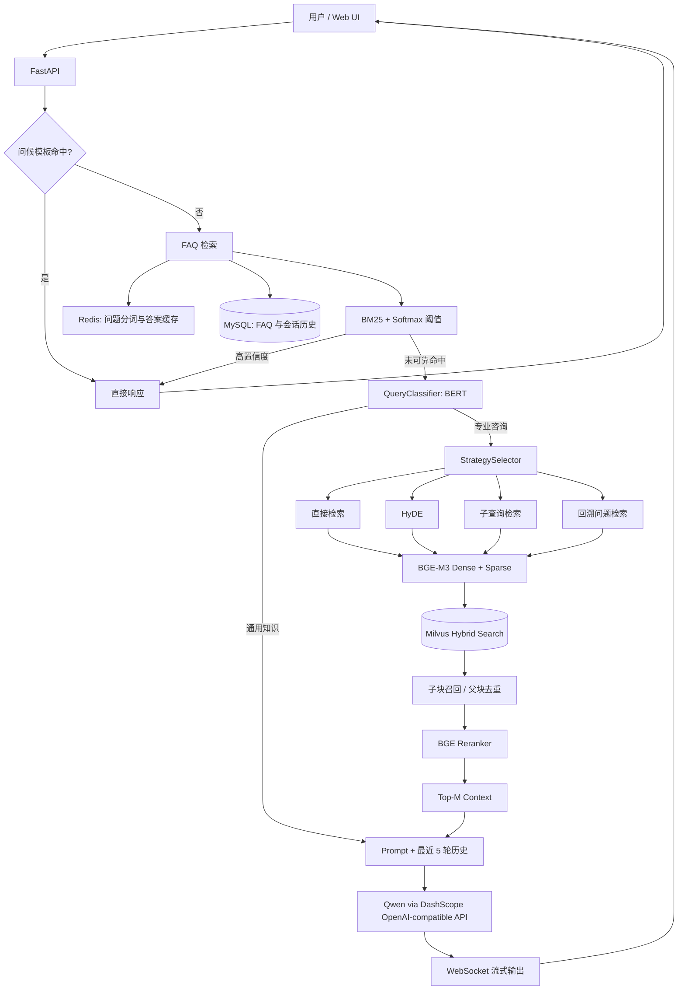

# EduRAG 智慧教育问答系统

EduRAG 是一个面向教育领域私有知识问答的工程化项目，将高频 FAQ 检索与 RAG（Retrieval-Augmented Generation）组合为双路径问答系统。系统优先从结构化 FAQ 中返回高置信度答案；无法可靠命中时，再进入查询分类、动态检索策略、Dense + Sparse Hybrid Retrieval、Reranker 与大模型生成链路，以提高私有知识覆盖率并降低大模型幻觉。

项目包含完整的文档入库、混合检索、对话历史、HTTP/WebSocket 服务与静态 Web 界面。仓库不会发布 API Key、数据库密码、模型权重、运行日志或原始私有知识库。

## 系统架构



系统当前具备面向 Agent/RAG 场景的“决策—执行”式检索编排：`QueryClassifier` 决定是否需要私有知识检索，`StrategySelector` 在直接检索、HyDE、子查询与回溯问题之间选择策略。它不是通用工具调用 Agent，README 不把尚未实现的能力包装成现有功能。

## 核心功能

- **FAQ + RAG 双路径**：BM25 高置信度命中直接返回，低置信度请求回退到 RAG。
- **Redis + MySQL FAQ 检索**：MySQL 保存问答，Redis 缓存原始问题、分词结果与查询答案。
- **查询意图分类**：本地 BERT 分类器区分“通用知识”和“专业咨询”。
- **动态检索策略**：LLM 驱动的 `StrategySelector` 支持直接检索、HyDE、子查询、回溯问题。
- **Hybrid Retrieval**：BGE-M3 同时生成 Dense 与 Sparse 表示，Milvus 使用加权融合完成混合召回。
- **父子分块 + 二阶段重排**：子块用于召回，父块用于上下文；BGE Reranker 对候选父块二次排序。
- **多格式文档解析**：支持 TXT、Markdown、PDF、DOCX、PPT/PPTX、JPG、PNG；图片型内容可走 RapidOCR。
- **多轮对话**：MySQL 持久化会话，仅将最近 5 轮问答注入 Prompt。
- **HTTP + WebSocket**：FastAPI 提供会话、历史、FAQ 查询、健康检查与流式生成接口。
- **离线评估与压测工具**：仓库包含 RAGAS 实验脚本和 Locust 压测脚本，但不宣称尚未复现的性能指标。

## 核心技术栈

| 层次 | 实现 |
| --- | --- |
| API / UI | FastAPI、Uvicorn、WebSocket、HTML/CSS/JavaScript |
| FAQ | MySQL、Redis、Jieba、rank-bm25 |
| RAG 编排 | LangChain Prompt / Document abstractions |
| Embedding | BGE-M3（Dense + Sparse） |
| Vector DB | Milvus / PyMilvus |
| Reranker | `sentence-transformers` CrossEncoder、BGE Reranker |
| Query Classifier | Transformers、BERT、PyTorch |
| LLM | Qwen，使用 DashScope 的 OpenAI-compatible API |
| 文档解析 / OCR | PyMuPDF、python-docx、python-pptx、Unstructured、RapidOCR |
| 评估 / 压测 | RAGAS（实验目录）、Locust |
| 基础设施 | Docker Compose、MySQL 8、Redis 7、Milvus 2.4、MinIO、etcd |

## 项目目录

```text
.
├── app.py                         # 当前推荐入口：FastAPI + WebSocket + Web UI
├── new_main.py                    # FAQ、RAG、LLM 与多轮会话的集成层
├── old_main.py                    # 保留的早期集成实现，不作为推荐入口
├── base/                          # 配置加载与日志
├── mysql_qa/                      # MySQL、Redis、BM25 FAQ 链路
├── rag_qa/
│   ├── core/                      # 分类、策略、Prompt、向量库、RAG 主流程
│   ├── edu_document_loaders/      # PDF/Word/PPT/图片解析与 OCR
│   ├── edu_text_spliter/          # 中文递归切分与语义切分实验
│   ├── classify_data/             # 查询分类训练数据与说明
│   └── rag_assesment/             # 离线评估实验
├── docker/                        # MySQL、Milvus、Redis、MinIO、etcd
├── static/                        # 静态 Web 界面
├── notebooks/                     # Milvus / Ollama 等实验记录
├── demo/                          # FastAPI、Redis、Logging 学习示例
├── config.example.ini             # 无敏感值的配置模板
└── requirements-*.txt             # Windows / macOS 依赖快照
```

`app.py` 导入 `new_main.IntegratedQASystem`，因此它是当前 Web 服务的真实入口。`old_main.py` 保留用于对照历史实现，没有删除。

## RAG 核心流程

### 1. 文档进入知识库

1. `document_processor.py` 遍历知识目录，并按扩展名选择 Loader。
2. TXT/Markdown 直接解析；PDF、Word、PPT、图片由自定义 Loader 提取文本，必要时调用 RapidOCR。
3. 文档被写入 `source`、`file_path`、`timestamp` 等 metadata；`source` 由 `<source>_data` 目录名推导。
4. 默认使用中文递归切分器或 Markdown 切分器，先生成父块，再生成子块；子块 metadata 保存 `parent_id` 与 `parent_content`。
5. BGE-M3 为每个子块同时生成 Dense 与 Sparse 向量。
6. Milvus 保存文本、两类向量、父块内容、来源与时间戳，并为 Dense / Sparse 字段分别建立索引。

### 2. 问题检索与生成

1. 专业咨询进入 `StrategySelector`，从四种检索策略中选择一种。
2. 查询或增强后的查询通过 BGE-M3 编码。
3. Milvus 分别执行 Dense 与 Sparse 检索，并用 `WeightedRanker(1.0, 0.7)` 融合结果。
4. 系统按父块内容去重，将子块召回恢复为更完整的父块上下文。
5. BGE Reranker 对查询—父块对打分，截取配置中的 `candidate_m` 个候选。
6. Context、当前问题与最近 5 轮对话进入 Prompt，Qwen 通过 DashScope 流式生成答案。

当前代码实现了 `source` metadata 过滤；更通用的 Metadata Filtering、权限过滤与时间过滤仍属于后续优化。

## FAQ 机制

FAQ 链路用于快速处理高频、答案稳定的问题：

1. MySQL 的 `jpkb` 表保存学科、问题、答案。
2. 服务启动时从 Redis 读取原始问题和分词结果；缓存缺失时回源 MySQL，并用 Jieba 预处理后写回 Redis。
3. 查询先检查 Redis 答案缓存；未命中时使用 `BM25Okapi` 计算相关性。
4. 代码将 BM25 得分经 Softmax 归一化，最高分达到 `0.85` 阈值时，从 MySQL 取出答案并缓存。
5. 未达到阈值时返回 `need_rag=True`，由集成层进入 RAG 链路。

该设计让高频 FAQ 避免不必要的 LLM 调用，同时保留对长尾私有知识问题的生成能力。

## 快速开始

### 1. 环境要求

- Python 3.10（项目本地缓存与依赖组合基于该版本）
- Docker Desktop / Docker Compose
- MySQL、Redis、Milvus 服务
- 可用的 DashScope API Key
- BGE-M3、BGE Reranker 和已训练的 BERT 查询分类器

GPU 不是代码层面的硬要求；`VectorStore` 会在 CUDA 不可用时回退到 CPU，但本地模型较大，CPU 启动与推理会更慢。

### 2. 安装依赖

Windows：

```powershell
python -m venv .venv
.\.venv\Scripts\Activate.ps1
python -m pip install --upgrade pip
pip install -r requirements-windows.txt
```

macOS：

```bash
python3 -m venv .venv
source .venv/bin/activate
python -m pip install --upgrade pip
pip install -r requirements-mac.txt
```

依赖文件是开发环境快照，包含训练、Notebook 与评估依赖；仅部署 API 时可在后续拆分精简依赖。

### 3. 准备配置

```powershell
Copy-Item .env.example .env
Copy-Item config.example.ini config.ini
```

编辑本地 `.env` / `config.ini`，至少设置 DashScope API Key 与 MySQL 密码。这两个文件都不会被 Git 跟踪；环境变量优先于 `config.ini`。

### 4. 启动基础设施

```powershell
docker compose --env-file .env -f docker/milvus_redis/docker-compose.yml up -d
docker compose --env-file .env -f docker/mysql/docker-compose.yml up -d
```

默认配置使用 Milvus database `itcast`。首次运行时请先创建该 database，或将 `MILVUS_DATABASE_NAME` 与 `config.ini` 中的 `database_name` 改为已有 database；Collection 会由 `VectorStore` 自动创建。

### 5. 准备本地模型

模型权重未提交。可以使用 Hugging Face Hub 下载公开模型：

```powershell
python -c "from huggingface_hub import snapshot_download; snapshot_download('BAAI/bge-m3', local_dir='rag_qa/models/bge-m3')"
python -c "from huggingface_hub import snapshot_download; snapshot_download('BAAI/bge-reranker-large', local_dir='rag_qa/models/bge-reranker-large')"
```

将训练好的二分类模型放到 `rag_qa/core/bert_query_classifier/`，或通过 `QUERY_CLASSIFIER_MODEL_PATH` 指向其他目录。训练相关实现位于 `rag_qa/core/query_classifier.py`、`train_bert.py` 和 `chatgpt_train_bert.py`。

### 6. 初始化 FAQ 数据

原始 FAQ CSV 因包含内部地址与课程数据未公开。准备拥有合法使用权限的 CSV，列名为 `学科名称`、`问题`、`答案`，然后执行：

```powershell
python -c "from mysql_qa.db.mysql_client import MySQLClient; c=MySQLClient(); c.create_table(); c.insert_data(r'mysql_qa/data/your_faq.csv'); c.close()"
```

### 7. 构建向量知识库

将授权文档放入 `rag_qa/data/ai_data/` 等 `<source>_data` 目录，再执行：

```powershell
python -c "from rag_qa.core.document_processor import process_documents; from rag_qa.core.vector_store import VectorStore; docs=process_documents(r'rag_qa/data/ai_data'); store=VectorStore(); store.add_documents(docs)"
```

### 8. 启动服务

```powershell
python app.py
```

默认地址：<http://localhost:8003>；FastAPI 交互文档：<http://localhost:8003/docs>。

## 配置说明

| 环境变量 | 作用 | 默认/示例 |
| --- | --- | --- |
| `DASHSCOPE_API_KEY` | Qwen API Key | 必填，不要提交 |
| `LLM_MODEL` | DashScope 模型名 | `qwen3-max`（示例配置） |
| `MYSQL_*` | FAQ 与会话数据库 | `localhost:3306` |
| `REDIS_*` | FAQ / 答案缓存 | `localhost:6379` |
| `MILVUS_*` | 向量数据库与 Collection | `localhost:19530` |
| `BGE_M3_PATH` | BGE-M3 本地目录 | `rag_qa/models/bge-m3` |
| `BGE_RERANKER_PATH` | Reranker 本地目录 | `rag_qa/models/bge-reranker-large` |
| `QUERY_CLASSIFIER_MODEL_PATH` | BERT 分类器目录 | `rag_qa/core/bert_query_classifier` |
| `PARENT_CHUNK_SIZE` / `CHILD_CHUNK_SIZE` | 父子块大小 | `1200` / `300` |
| `RETRIEVAL_K` / `CANDIDATE_M` | 召回与最终上下文数量 | `5` / `2` |

完整模板见 `.env.example` 与 `config.example.ini`。不要把真实值写入 README、Issue、日志或提交历史。

## API / 使用示例

### 创建会话

```powershell
Invoke-RestMethod -Method Post -Uri http://localhost:8003/api/create_session
```

### FAQ 查询预判

```powershell
$body = @{
  query = "你的问题"
  session_id = "your_session_id"
  source_filter = "ai"
} | ConvertTo-Json

Invoke-RestMethod -Method Post -Uri http://localhost:8003/api/query `
  -ContentType "application/json" -Body $body
```

当 FAQ 命中时，接口直接返回答案；当响应中的 `is_streaming` 为 `true` 时，客户端应连接 WebSocket。

### WebSocket 流式问答

连接 `ws://localhost:8003/api/stream`，发送：

```json
{
  "query": "你的问题",
  "session_id": "your_session_id",
  "source_filter": "ai"
}
```

服务端依次发送 `start`、多个 `token`，最后发送 `end`；异常时发送 `error`。

### 其他接口

| 方法 | 路径 | 说明 |
| --- | --- | --- |
| `GET` | `/` | 静态 Web UI |
| `GET` | `/health` | 健康检查 |
| `GET` | `/api/sources` | 可用学科来源 |
| `GET` | `/api/history/{session_id}` | 最近会话历史 |
| `DELETE` | `/api/history/{session_id}` | 清理会话历史 |

## 项目亮点

- 用确定性 FAQ 快路径与生成式 RAG 慢路径平衡响应成本和长尾覆盖。
- 在同一 BGE-M3 表示模型上同时使用 Dense / Sparse Retrieval，并在 Milvus 内融合。
- 采用“子块召回、父块生成”的层次化分块，兼顾检索粒度与上下文完整性。
- 通过 CrossEncoder Reranker 形成“粗召回 + 精排”的两阶段检索。
- QueryClassifier 与 StrategySelector 将意图路由和检索策略选择显式模块化。
- WebSocket 流式输出与 MySQL 会话历史构成可演示的端到端问答体验。
- Loader、Splitter、VectorStore、RAG 编排、API 层彼此分离，便于替换模型与组件。

## 数据与大文件说明

以下内容保留在本地但不会上传：

- BGE-M3、BGE Reranker、文档分割模型与 BERT 分类器权重；
- 训练 checkpoint、optimizer、ONNX 与 Safetensors 文件；
- Milvus / Redis / MySQL / MinIO / etcd 持久化目录；
- 原始课程知识库、OCR 样例和含内部地址的 FAQ CSV；
- 日志、Locust 响应时间 CSV 与生成的 RAGAS 结果；
- 含本机路径输出的部分 Notebook。

仓库仅保留获取/生成说明，不删除上述本地文件。

## 后续优化

- 建立可复现的检索指标与 RAGAS 自动评测基线；
- 增加 Recall@K、MRR、NDCG 与端到端忠实度评测；
- 引入 Query Rewrite、会话感知检索与更稳健的策略路由；
- 完善 Metadata Filtering、数据权限与多租户隔离；
- 增加语义缓存、答案缓存失效与热点预热策略；
- 将策略编排扩展为带工具调用、知识库管理与人工升级的 Agent；
- 增加 tracing、token/cost、检索命中与延迟可观测性；
- 补充自动化测试、CI 与容器化应用部署。

## License

本项目采用 [MIT License](LICENSE)。公开使用前，请自行确认所导入知识文档、训练数据与模型的许可证和数据授权。
